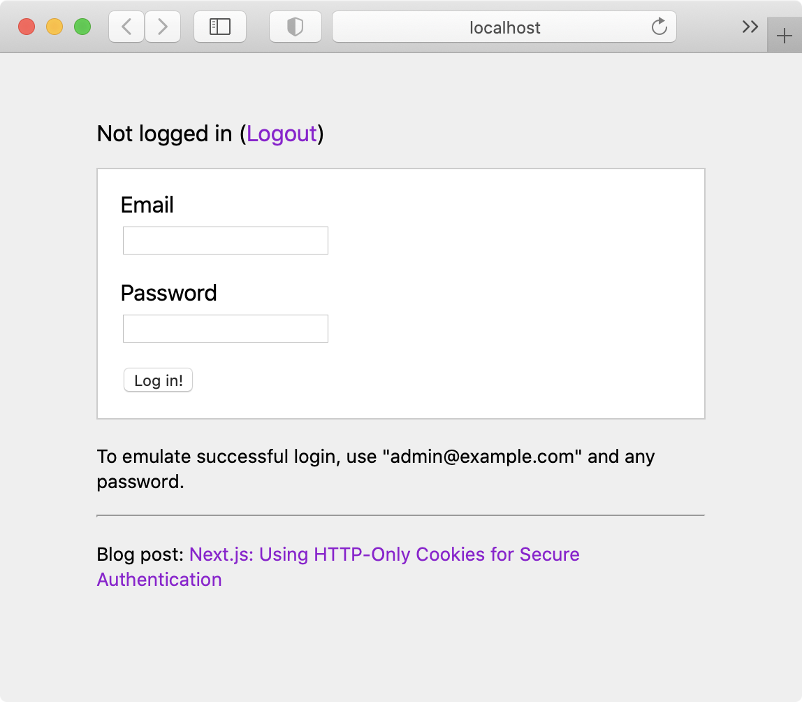

# Example App: Next.js + HTTP-Only Cookies for Authentication

An example application that demonstrates using HTTP-only cookies for secure authentication with Next.js.

This project contains demo login/logout pages, an API Proxy, as well as two endpoints that simulate an API.

-   [View live version hosted on Vercel](https://next-auth.maximilianschmitt.vercel.app)
-   [Read the blog post](https://maxschmitt.me/posts/next-js-http-only-cookie-auth-tokens)

## Screenshot



## Setup

```
git clone git@github.com:maximilianschmitt/next-auth.git
cd next-auth
yarn
yarn dev
```

## Overview

### pages/api/proxy/[...path].js

The API Proxy implementation.

### pages/api/login.js

A demo API endpoint for logging in.

-   Responds with `200 { "authToken" "..." }` if login was successful
-   Responds with `400 { "error" "..." }` if login was not successful

### pages/api/me.js

A demo API endpoint for getting the currently authenticated user.

-   Responds with `200 { "email" "..." }` if a valid `auth-token` HTTP header is set
-   Responds with `401 { "error" "..." }` if `auth-token` is missing
-   Responds with `403 { "error" "..." }` if `auth-token` is invalid

### pages/index.js

The demo login page. Makes client-side AJAX requests to the API Proxy as well as server-side requests to the API in `getServerSideProps()`.

Client-side requests are made to `/api/proxy/*`. Server-side requests are made to `/api/*`.

### pages/logout.js

The logout page. Unsets the `auth-token` cookie and redirects back home.
